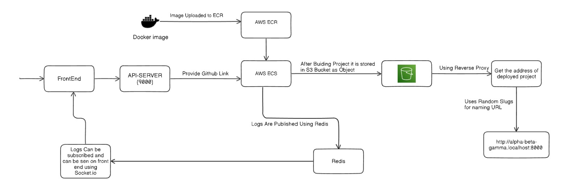

# Swiftdeploy

Swiftdeploy is a powerful platform designed to simplify the process of deploying projects using AWS services like S3, ECS, and ECR. First, a Docker file is created and uploaded to ECR. AWS ECS then utilizes that Docker image to deploy a new project every time a request is made. Each deployment spins up a separate container, ensuring isolation and preventing security issues between different deployments and assigns a random name/slug to each deployment. Additionally, it provides a reverse proxy to make your website easily accessible.

## Features

- **Automated Deployments**: Use AWS S3 for storage, ECS for container orchestration, and ECR for managing Docker images.
- **Docker Support**: Swiftdeploy uses Docker to ensure your project is deployed in a reliable and consistent environment.
- **Random Slug Assignment**: Each deployed project is assigned a unique and random name/slug for easy identification.
- **Reverse Proxy**: Swiftdeploy uses a reverse proxy to map your project’s slug to a user-friendly URL for seamless access.

## Tech Stack

- **Docker**: Written docker file for image and it is uploaded on ECR.
- **AWS ECR**: Used to store Docker image for making containers.
- **AWS ECS**: Manages the running containers for your deployed applications.
- **AWS S3**: Used for storing static assets and other files.
- **Random Slugs**: Automatically assigns memorable random names to your projects (powered by `random-word-slugs`).
- **Reverse Proxy**: Handles requests and forwards them to the correct deployed instance.

## Usage

1. Provide github link of project.
2. Each deployment will be assigned a random name/slug for easy access.
3. The reverse proxy will ensure that the deployed project is available at a user-friendly URL like http://alpha-beta-gamma.localhost:8000.

Ports
| S.No | Service           | Port  |
|------|-------------------|-------|
| 1    | api-server        | :9000 |
| 2    | socket.io-server  | :9002 |
| 3    | s3-reverse-proxy  | :8000 |